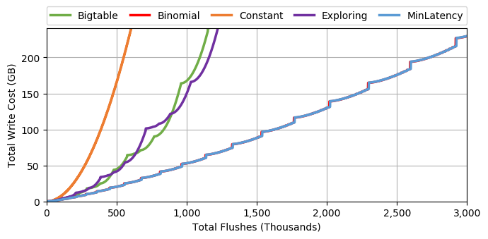
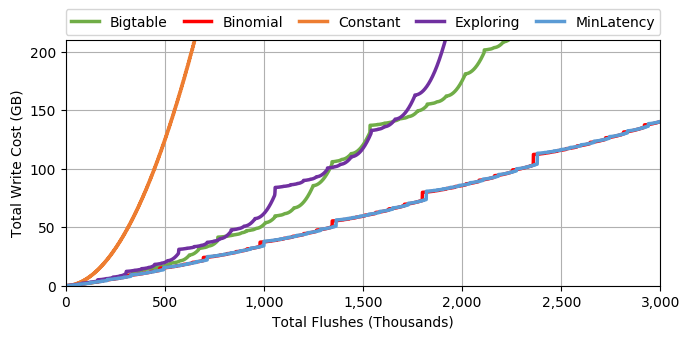
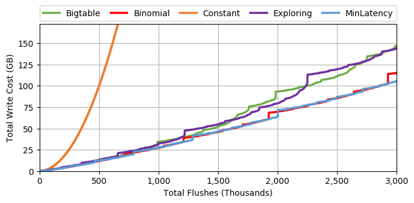
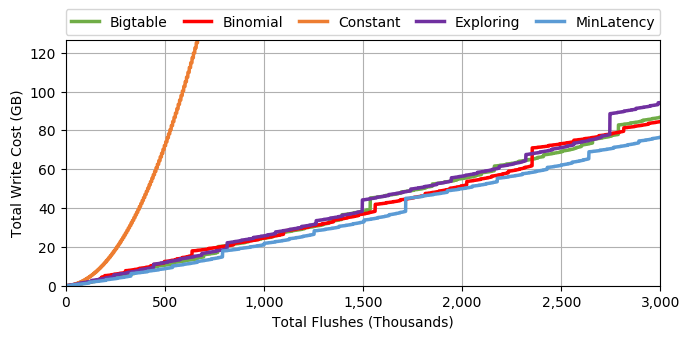
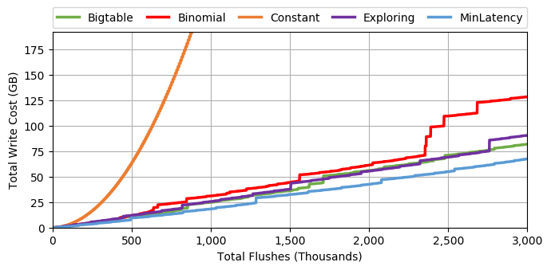
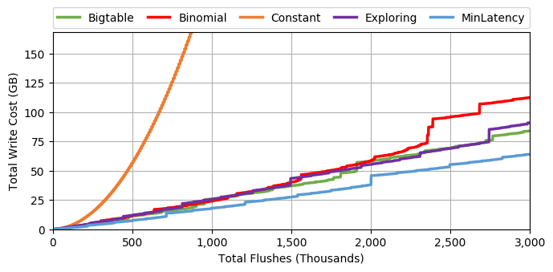
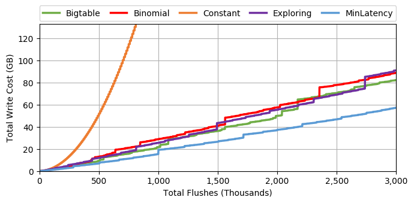

# Simulator for LSM-tree Merge Policies

## [simulator/MergePolicy.py](simulator/MergePolicy.py)
Classes for merge policy simulator.

## [example/write_cost_example.py](example/write_cost_example.py)
Example to simulate write cost for 5 merge policies.

k = 3

k = 4

k = 5

k = 6

k = 7

k = 8

k = 9

k = 10

